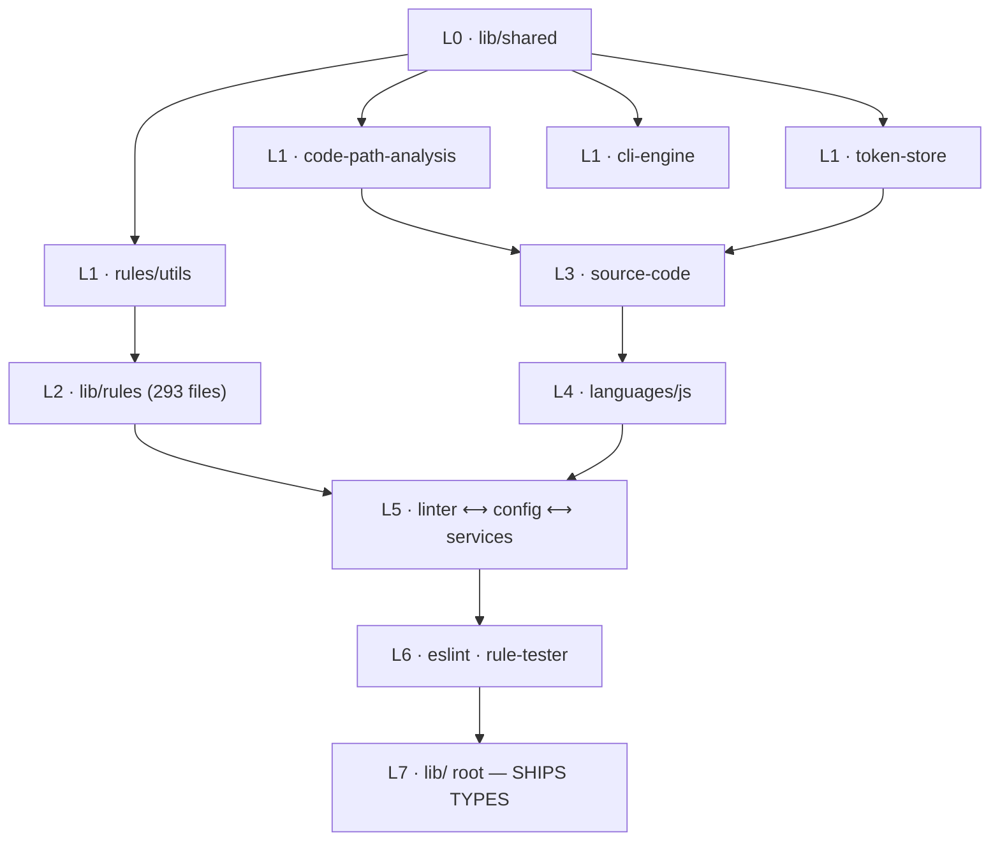

# Adding TypeScript types to ESLint via JSDoc source annotation

|                   |                                                            |
| ----------------- | ---------------------------------------------------------- |
| **Epic**          | `eslint-shreni-beads-y6r`                                  |
| **Status**        | Phases 0–1 landed · phases 1b–2 filed · phases 3–9 roadmap |
| **Beads**         | `y6r.1` … `y6r.17` (17 children)                           |
| **Critical path** | `y6r.2 → y6r.15 → y6r.14 → y6r.5 → y6r.6`                  |
| **Updated**       | 2026-08-08 — re-planned after the phase-0 dependency audit |

> **Document history.** This note has had four prior versions, each of which
> overwrote the last: the original planning note (`e08a1577d`, never merged to
> main), the implementation note written alongside PR #1 (`186ce5981`), the
> dependency audit (`97e8c0aa5`), and the type-check gate section
> (`f206b5511`). This version merges all four. Nothing that was written
> down has been dropped; content that later turned out to be wrong is marked
> **superseded** in place rather than deleted, because the reasoning is still
> worth having.

---

## 1. Problem

ESLint used to ship hand-authored `.d.ts` files under `lib/types/`. Those files
were a second, parallel description of the implementation, maintained by hand,
with nothing mechanically tying the two together. Nothing failed when a
signature in `lib/` changed and the declaration did not. Drift was not a risk;
it was the steady state.

This repository is a checkout of ESLint v10.8.0 with **all type information
deliberately removed** to create a from-scratch baseline. Measured at that
baseline (2026-08-07, before any of the work below):

| Signal                                         | Value at baseline                   |
| ---------------------------------------------- | ----------------------------------- |
| `@param` tags in `lib/`                        | **2,945** — _zero_ carry a `{type}` |
| `@returns` tags in `lib/`                      | **1,340** — _zero_ carry a `{type}` |
| `@typedef` declarations                        | **0**                               |
| `.d.ts` files                                  | **0**                               |
| `tsconfig*.json`                               | **0**                               |
| `types` / `exports.types` in `package.json`    | absent                              |
| `stack.buildCommand` in `.shreni/kshetra.yaml` | empty string — no build gate        |

A TypeScript project consuming this package at that point got **nothing**: no
declaration file, no `types` field, no way to resolve types for `ESLint`,
`Linter`, `RuleTester`, or `SourceCode`.

## 2. Goal and user stories

Ship type declarations generated from the JavaScript source, serving four users:

1. **TS application developer** — uses ESLint programmatically (`new ESLint()`,
   `lintFiles`, `Linter#verify`) and currently must hand-write declarations or
   cast to `any`.
2. **Plugin / custom-rule author** — writes rules in TypeScript and needs
   `Rule`, `RuleContext`, `RuleModule`, `RuleFixer`, `SourceCode` to be real
   types so their rule implementation is checked.
3. **TS config author** — writes `eslint.config.ts` and wants rule names _and
   their options_ to autocomplete and type-check.
4. **ESLint maintainer** — gets compiler-verified refactoring across `lib/`.

All four are weighted equally. Story 3 is what the phase 9 rule-options
generator exists to serve; story 4 is what justifies annotating internals rather
than only the public surface.

## 3. Scope and compatibility

**In scope** — all of `lib/` (381 files, ~96,700 LOC); `packages/js/src`
(3 files, ~309 LOC, published as `@eslint/js`); `bin/eslint.js`.

**Out of scope** — `tools/`, `tests/`, `packages/eslint-config-eslint`.

**Compatibility** — TypeScript **6.x** floor (matches the existing
`typescript@^6.0.3` devDependency). `moduleResolution`: **`node16`/`nodenext`**
and **`bundler`**. Legacy `node10` resolution and `typesVersions` gymnastics are
**not** supported.

## 4. Approach

### 4.1 Source-first, declarations generated

JSDoc types are written **directly in the `.js` files**; `.d.ts` is produced by
declaration emit:

```
lib/**/*.js  --(tsc --allowJs --declaration --emitDeclarationOnly)-->  dist/types/**/*.d.ts
```

A declaration cannot drift from its implementation because there is no
declaration to drift — only an output. The same annotations that produce the
declarations also type-check the source that carries them, so a wrong annotation
is a build failure rather than a silent lie to consumers. A hand-written
declaration layer would be faster to ship but would be verified by nothing.

### 4.2 Vocabulary authored in-repo, and small

`lib/types/core.d.ts` is the one hand-authored type file. It holds only types
that cross module boundaries and therefore have no single owning module —
`Severity`, `LintMessage`, `LintResult`, `Fix`, and so on. Anything owned by
exactly one module is declared with `@typedef` in that module's own `.js` file
and flows outward through declaration emit.

The full intended vocabulary:

> `RuleDefinition`, `RuleModule`, `RuleContext`, `RuleFixer`, `RuleFix`,
> `ReportDescriptor`, `SourceCode`, `Language`, `LanguageOptions`, `Config`,
> `Severity`, `LintMessage`, `LintResult`, `SuppressedLintMessage`, `Parser`,
> `ParserOptions`, `Processor`

**`@eslint/core` is deliberately not adopted.** It is a types-only package with
zero direct `require`s in this codebase, and taking it would mean inheriting an
external vocabulary rather than authoring one. The vocabulary is the one thing
the whole conversion is anchored to; an external package that can change shape
between releases is the wrong place for it. The trade-off accepted: more
authoring work, and a standing obligation to stay structurally compatible with
`@eslint/config-array` and `@eslint/plugin-kit` — which _do_ ship their own
declarations — at the four call sites where we interoperate with them
(`lib/config/config.js`, `lib/config/flat-config-array.js`,
`lib/linter/linter.js`, `lib/languages/js/source-code/source-code.js`).

Every type in `core.d.ts` names, in its doc comment, the implementation site
that produces or consumes it, so the shape can be re-verified against the code
rather than trusted.

### 4.3 `strict: true` from commit one

Not "start loose and tighten later". Loosening is a one-line config change;
tightening after 380 files have been annotated against a permissive compiler is
a rewrite. The cost of strictness is paid per file as each file is converted,
which is the only point at which anyone has the context to pay it.

### 4.4 Green CI — superseded, see §5.2

> **⚠️ Superseded 2026-08-08.** The original plan was a growing `include`
> allowlist, with this warning attached: TypeScript's `include` only selects
> **root** files, so any file _imported_ by an included file is still pulled
> into the program and type-checked — meaning the allowlist alone cannot hold
> the line. The warning was correct. The proposed remedy, `// @ts-nocheck`
> headers on not-yet-annotated files, was **not** what shipped. The mechanism
> that did ship is per-file opt-in with `// @ts-check` under `checkJs: false`,
> which solves the same problem from the other direction, and which bead y6r.2
> went on to prove with a counterfactual test. See §5.2 and §5.3.

### 4.5 Escape hatches are allowed, and must say why

Some code cannot be typed without being rewritten, and rewriting working code to
satisfy the compiler trades a real risk for a cosmetic one. Where an escape
hatch (`any`, a cast, `@ts-expect-error`) is used, it carries an inline comment
beginning **`ESCAPE HATCH:`** that states what was widened and the specific
reason the precise type is not expressible. A reader should never have to guess
whether an `any` is a decision or an oversight.

**Runtime behavior must not change** to accommodate a type. Refactoring an
implementation to be typeable was considered and rejected as too
regression-prone for core paths — and the audit turned up a concrete instance of
the temptation, in `@types/esutils` — see **Decisions taken** below.

---

## 5. Landed: the type-check gate and the phase 0–1 foundation

Commit `186ce5981` (PR #1) implemented the epic bead directly rather than
leaving it as a parent, landing the tsconfig trio, declaration emit and the
first 25 annotated files. Commit `f206b5511` (bead `y6r.2`) then made the gate
blocking, declared its inputs, and — the part that matters most — _demonstrated_
that the mechanism works.

Read this section before starting any annotation bead.

### 5.1 The gate

`npm run lint:types` (`tsc -p tsconfig.json`) type-checks the allowlist under
`strict: true`. It runs in three places: as its own blocking **Type Check** CI
job, inside `node Makefile lint` so the local `npm run lint` catches it too, and
as `stack.buildCommand` in `.shreni/kshetra.yaml`.

`tsconfig.base.json` holds the compiler options, `tsconfig.json` adds the
allowlist and `noEmit`, and `tsconfig.types.json` extends that for declaration
emit (`npm run build:types`). Splitting them means the checked file set and the
emitted file set cannot drift apart.

Compiler settings worth knowing: `strict: true`, `module`/`moduleResolution`
`NodeNext`, `target`/`lib` `ES2022`, `types: ["node"]`,
`resolveJsonModule: true`, `skipLibCheck: true`,
`forceConsistentCasingInFileNames: true`.

### 5.2 The include-vs-traversal trap, and what resolves it

A `files`/`include` list selects only the **root** files of the program.
Everything those roots require is pulled in as well, and under `checkJs: true`
it is type-checked with them. On a codebase converting incrementally that makes
a growing allowlist unworkable: adding one annotated module drags its entire
un-annotated dependency subtree into the build and fails on code nobody has
touched. A "growing allowlist" is not, on its own, a strategy.

The companion mechanism is **`checkJs: false` plus a per-file `// @ts-check`
pragma**:

- The allowlist decides what is _in the program_.
- The pragma decides what is _checked_.

A required file with no pragma is still parsed and still used for inference —
so callers get real types from it — but nothing in it is ever reported. That
makes conversion order independent of the dependency graph, which is what lets
the work proceed bottom-up one file at a time.

`tests/lib/types/types.js` enforces that the allowlist and the pragmas agree
**in both directions**, so neither can drift from the other.

The alternative considered was `// @ts-nocheck` headers on every un-annotated
file, removed as each is claimed. It was rejected: it requires touching ~370
files that no one is converting, it inverts the default so a _new_ un-annotated
file silently breaks the build, and `@ts-nocheck` suppresses errors in a file
that a later reader cannot distinguish from a file that genuinely passes.
`checkJs: false` gets the same result with no source churn.

> This is the resolution to the trap that bead `y6r.2` flagged, and it is the
> **opposite** of the `@ts-nocheck` remedy that bead proposed. **Do not
> reintroduce `checkJs: true`, and do not add `@ts-nocheck` headers.**

### 5.3 Demonstrated, not asserted

`tests/lib/types/include-traversal.js` proves the mechanism against the real
compiler rather than restating it. It builds programs from the shipped
`tsconfig.json` and checks:

1. **The trap is real.** Files outside the allowlist do reach the program.
   Adding `tests/fixtures/types/allowlist-growth/annotated-consumer.js` — an
   annotated stand-in for the next file to be converted — pulls in
   `lib/rules/utils/ast-utils.js`, which is neither annotated nor allowlisted.
   The test also asserts `ast-utils.js` still lacks a pragma, so the
   demonstration cannot quietly become vacuous once that file is converted.
2. **The mechanism holds.** That same program reports **0 errors**.
3. **It is load-bearing, not luck.** The identical file set compiled with
   `checkJs: true` reports **158 errors, every one of them from
   `ast-utils.js`** — an un-annotated file. This is the counterfactual that
   makes result (2) mean something.
4. **Checking is genuinely on.** `annotated-with-error.js` carries a pragma and
   a deliberate type error, and is reported. Without this, result (2) would
   also be satisfied by a compiler checking nothing at all.

Point 3 is why the suite is worth its runtime: flipping `checkJs` to `true` in
`tsconfig.base.json` fails these tests immediately, so the decision cannot be
reverted by accident.

### 5.4 What is wired

| Concern                         | Where                                                                                                                         |
| ------------------------------- | ----------------------------------------------------------------------------------------------------------------------------- |
| Type check (CI)                 | Dedicated blocking `type_check` job running `npm run lint:types` then `npm run build:types`                                   |
| Type check (local)              | `target.lint` in `Makefile.js` (~line 29) runs `tsc -p tsconfig.json`, so it rides on the repo lint command                   |
| Type check (Shreni)             | `stack.buildCommand: pnpm lint:types` in `.shreni/kshetra.yaml` — note that file is gitignored, so it never appears in a diff |
| Declaration emit                | `tsconfig.types.json` → `npm run build:types` → `target.buildTypes`, emitting to `dist/types` with `rootDir` pinned           |
| Allowlist ↔ pragma guard        | `tests/lib/types/types.js`                                                                                                    |
| Traversal-mechanism guard       | `tests/lib/types/include-traversal.js`                                                                                        |
| Dependency-classification guard | `tests/lib/types/dependency-type-availability.js`                                                                             |

### 5.5 Declared inputs

`@types/node`, `@types/estree`, and `@types/debug` are explicit
`devDependencies`, closing the gap the audit recorded. `@types/estree` is in
`knip.jsonc`'s `ignoreDependencies` because nothing `require()`s it — it is
consumed by the compiler, through `eslint-scope`'s own declarations, which Knip
cannot see.

Still undeclared: the seven remaining DefinitelyTyped packages the audit
verified. Six of them — `cross-spawn`, `esquery`, `glob-parent`, `is-glob`,
`json-stable-stringify-without-jsonify`, `natural-compare` — are bead `y6r.16`;
`imurmurhash` is bead `y6r.17`, which needs it in order to retire a hand-written
ambient. None is needed until the allowlist reaches its consumer, and
`cross-spawn` is the first to be reached, by `lib/shared/runtime-info.js` in
`y6r.5`.

### 5.6 What is annotated

25 files. All of `lib/shared` **except** the four with external requires (see
**The four blocked `lib/shared` files**);
`lib/rules/utils/{keywords,code-path-utils,regular-expressions,lazy-loading-rule-map}.js`;
`lib/cli-engine/hash.js`; `lib/linter/{interpolate,timing}.js`;
`lib/linter/code-path-analysis/id-generator.js`; `packages/js/src/index.js`;
`conf/ecma-version.js`.

### 5.7 What the vocabulary covers so far

`lib/types/core.d.ts` (315 lines) holds the **results half** only: `SourceRange`,
`Position`, `SourceLocation`, `Severity` and its three representations,
`EcmaVersion`, `Fix`, `LintSuggestion`, `LintMessage`, `LintSuppression`,
`SuppressedLintMessage`, `MessageCounts`, `LintTimes`, `LintStats`,
`DeprecatedInfo`, `DeprecatedRuleUse`, `LintResult`.

It contains **no rule, config, source-code, or AST types**. That gap is the
subject of beads `y6r.3` and `y6r.15`, and it is what actually gates the rest of
the epic — see **The gap the audit exposed**.

`lib/types/vendor.d.ts` holds hand-authored ambient declarations for
dependencies with no upstream types. It currently declares one module,
`imurmurhash`, on a premise the audit has since disproved — see
**Corrections the audit forces**.

### 5.8 Commands

| Command                              | What it does                                          |
| ------------------------------------ | ----------------------------------------------------- |
| `npm run lint:types`                 | Type-check the allowlist. Also run by `npm run lint`. |
| `npm run build:types`                | Generate `.d.ts` into `dist/types` (gitignored).      |
| `npx mocha tests/lib/types/types.js` | Test the pipeline itself.                             |

### 5.9 How to convert a file

1. Add `// @ts-check` as the file's first line.
2. Add the path to `files` in `tsconfig.json`, keeping the section order.
3. Run `npm run lint:types` and annotate until it is clean.
4. Prefer a module-local `@typedef` over adding to `core.d.ts`. Add to
   `core.d.ts` only when a second module needs the same type.
5. Where an escape hatch is unavoidable, write the `ESCAPE HATCH:` comment
   (§4.5).

## 6. The dependency graph — why the order is what it is

The rollout follows the **measured** internal dependency structure of `lib/`,
bottom-up.

| Layer  | Directories                                                                                            | Files |    LOC |
| ------ | ------------------------------------------------------------------------------------------------------ | ----: | -----: |
| **L0** | `lib/shared` — depends on nothing                                                                      |    19 |  1,392 |
| **L1** | `rules/utils`, `code-path-analysis`, `token-store`, `cli-engine`, `cli-engine/formatters` — only on L0 |    33 | 10,162 |
| **L2** | `lib/rules`                                                                                            |   293 | 70,681 |
| **L3** | `languages/js/source-code`                                                                             |     2 |  1,161 |
| **L4** | `languages/js`                                                                                         |     2 |    519 |
| **L5** | `linter` ⟷ `config` ⟷ `services` — **3-node cycle**                                                    |    22 |  7,043 |
| **L6** | `eslint`, `rule-tester`                                                                                |     6 |  4,886 |
| **L7** | `lib/` root — pure sink, nothing imports it                                                            |     6 |    969 |



### 6.1 Two structural facts that drive everything

**`lib/rules/utils/ast-utils.js` is the chokepoint.** 2,962 LOC with **193
inbound edges** — by a wide margin the most-required file in the repository. Its
type quality gates roughly **75% of `lib/`**. 137 of its functions take
implicitly-`any` parameters. Annotating those parameters is mechanical, but it
is not the expensive part: once the parameters have types, property access on
the node unions starts failing, and each failure is a small judgement about what
the function actually accepts. It is typed immediately after `lib/shared`, in its
own bead, and it blocks `fix-tracker.js` and `char-source.js`, which is why those
two are not in the phase 1 allowlist despite being small.

> The audit materially shrank this file's _dependency_ risk — see **Impact on the
> `ast-utils` chokepoint** in the audit below. What
> remains large is the judgement work above, which no audit can remove.

**The L5 cycle is a directory artifact, not a real one.** `linter` ⟷ `config` ⟷
`services` form a 3-node SCC, closed by exactly three edges:

- `config/config-loader.js` → `services/warning-service.js`
- `services/processor-service.js` → `linter/vfile.js`
- `linter/linter.js` → `config/config.js`

At **file** granularity there are **zero cycles** — every module topologically
orders. So the L5 beads are _file_-scoped, starting with the two near-leaves
(`warning-service.js`, `vfile.js`) that break the cycle.

### 6.2 Ordering decision: bottom-up, not surface-first

Surface-first was considered and **rejected**. The public surface sits at L5–L7
— the _top_ of the graph. Typing `Linter#verify` before the things it calls and
returns are typed means asserting shapes into the vocabulary and hoping the
implementation agrees later. With `ast-utils.js` gating 75% of the tree, a wrong
early assertion propagates very far before anything contradicts it.

**Accepted cost:** consumer-facing declarations ship at the _end_ of the
migration rather than early. In exchange, no shape is ever guessed and there is
no rework at the seams.

---

## Phase 0 spike — runtime dependency type-availability audit

`eslint-shreni-beads-y6r.1`. No annotation work; findings only.

Under `strict: true`, a dependency that ships no declarations makes every value
that flows out of it an implicit `any`, and `noImplicitAny` turns the bare
`require()` itself into a hard error (TS7016). This spike establishes, for each
of the 28 runtime dependencies, whether declarations exist, where they come
from, and whether they actually typecheck against the call sites in `lib/`.

### Method

Three independent checks, none of them a reading of the README:

1. **Resolution.** `ts.resolveModuleName()` was run for every specifier that
   `lib/`, `bin/`, and `packages/js/src` actually `require()`, under
   `moduleResolution: node16` and `bundler`, with `allowJs` and
   `resolveJsonModule`. The recorded answer is the resolved file and its
   extension — `.d.ts`/`.d.cts`/`.d.mts` means typed, `.js`/`.cjs` means not.
   This is deliberately _not_ a read of the `types` field in `package.json`,
   because that field is ignored when an `exports` map is present — see
   `@humanwhocodes/module-importer` below, which is exactly that trap.
2. **Compilation.** Probe files reproducing the real import shapes and the real
   call sites (`esutils.keyword.isIdentifierES6(name)`,
   `fileDescriptor.meta.hashOfConfig`, `spawn.sync(cmd, args, {encoding})`, …)
   were compiled at `strict: true`. A dependency only counts as typed if the
   probe compiles clean, not if a declaration file merely exists.
3. **Registry.** `npm view @types/<dep>` for everything that failed check 1,
   and the candidate `@types` tarball was downloaded, staged into
   `node_modules/@types`, and put through check 2.

### Verdict

| Dependency                              | Version | Class         | Resolves to                                          |
| --------------------------------------- | ------- | ------------- | ---------------------------------------------------- |
| `@eslint-community/eslint-utils`        | 4.10.1  | ships-types   | `index.d.ts` (cjs) / `index.d.mts` (esm)             |
| `@eslint-community/regexpp`             | 4.12.2  | ships-types   | `index.d.ts`                                         |
| `@eslint/config-array`                  | 0.23.5  | ships-types   | `dist/cjs/index.d.cts`                               |
| `@eslint/config-helpers`                | 0.7.0   | ships-types   | `dist/cjs/index.d.cts`                               |
| `@eslint/plugin-kit`                    | 0.7.2   | ships-types   | `dist/cjs/index.d.cts`                               |
| `@humanfs/node`                         | 0.16.8  | ships-types   | `dist/index.d.ts` (ESM mode only)                    |
| `@humanwhocodes/retry`                  | 0.4.3   | ships-types   | `dist/retrier.d.cts`                                 |
| `ajv`                                   | 6.15.0  | ships-types   | `lib/ajv.d.ts`                                       |
| `escape-string-regexp`                  | 4.0.0   | ships-types   | `index.d.ts`                                         |
| `eslint-scope`                          | 9.1.2   | ships-types   | `lib/index.d.cts`                                    |
| `eslint-visitor-keys`                   | 5.0.1   | ships-types   | `dist/eslint-visitor-keys.d.cts`                     |
| `espree`                                | 11.2.0  | ships-types   | `dist/espree.d.cts`                                  |
| `fast-deep-equal`                       | 3.1.3   | ships-types   | `index.d.ts`                                         |
| `find-up`                               | 5.0.0   | ships-types   | `index.d.ts`                                         |
| `ignore`                                | 5.3.2   | ships-types   | `index.d.ts`                                         |
| `minimatch`                             | 10.2.6  | ships-types   | `dist/commonjs/index.d.ts`                           |
| `cross-spawn`                           | 7.0.6   | needs-@types  | `@types/cross-spawn@6.0.6`                           |
| `debug`                                 | 4.4.3   | needs-@types  | `@types/debug@4.1.13`                                |
| `esquery`                               | 1.7.0   | needs-@types  | `@types/esquery@1.5.4`                               |
| `glob-parent`                           | 6.0.2   | needs-@types  | `@types/glob-parent@5.1.3`                           |
| `imurmurhash`                           | 0.1.4   | needs-@types  | `@types/imurmurhash@0.1.4`                           |
| `is-glob`                               | 4.0.3   | needs-@types  | `@types/is-glob@4.0.4`                               |
| `json-stable-stringify-without-jsonify` | 1.0.1   | needs-@types  | `@types/json-stable-stringify-without-jsonify@1.0.2` |
| `natural-compare`                       | 1.4.0   | needs-@types  | `@types/natural-compare@1.4.3`                       |
| `esutils`                               | 2.0.3   | needs-ambient | `lib/utils.js`                                       |
| `file-entry-cache`                      | 8.0.0   | needs-ambient | `cache.js`                                           |
| `optionator`                            | 0.9.4   | needs-ambient | `lib/index.js`                                       |
| `@humanwhocodes/module-importer`        | 1.0.1   | needs-ambient | `src/module-importer.cjs`                            |

16 ship-types, 8 need a DefinitelyTyped package, 4 need a locally-authored
ambient module. The four `needs-ambient` entries are the entire cost this spike
was commissioned to size.

### The bead's prior assumptions, verified

Confirmed as stated: `@eslint/config-array`, `@eslint/plugin-kit`, and
`@eslint/config-helpers` all ship their own declarations, and `@eslint/core` is
not a dependency of this package (it arrives only transitively, under
`@eslint/plugin-kit`).

Corrected: the bead listed `ajv`, `minimatch`, `debug`, `@humanwhocodes/retry`,
and `@humanwhocodes/module-importer` as open questions. Four of those five are
settled cheaply — `ajv`, `minimatch`, and `@humanwhocodes/retry` ship
declarations, and `debug` has a maintained DT package. Only
`@humanwhocodes/module-importer` is a real problem, and not for the reason one
would guess.

### needs-ambient — why, and what the declaration must cover

Each of these needs a `.d.ts` in-repo (proposed home: `lib/types/vendor/`).
The listed surface is the complete set of symbols `lib/` touches — nothing
wider needs to be declared.

#### `optionator@0.9.4`

`npm view @types/optionator` returns **404**; no DefinitelyTyped package has
ever existed. This is the only dependency with no upstream option at all.

Used by `lib/options.js:12` only. Consumed surface:

- the factory call `optionator({ prepend, defaults, options })`, where `options`
  is the heterogeneous array of heading entries and option descriptors that
  makes up the whole of `lib/options.js`;
- on the returned instance, `parse(args)` (`lib/cli.js:204`) and
  `generateHelp()` (`lib/cli.js:215`).

`generateHelpForOption()` is advertised in the comment at `lib/options.js:22`
but is not called anywhere in `lib/` or `bin/`; it does not need declaring.
The `options` array is the interesting part — typing it precisely is what would
give `lib/cli.js` a checked `ParsedCLIOptions` instead of an `any`, so the
ambient module should be written option-descriptor-first, not as
`declare function optionator(o: any): any`.

#### `@humanwhocodes/module-importer@1.0.1`

The package **does** ship `dist/module-importer.d.ts` and
`dist/module-importer.d.cts`, and its `package.json` sets
`"types": "dist/module-importer.d.ts"`. It is still untyped in practice: the
`exports` map is

```json
"exports": { "require": "./src/module-importer.cjs", "import": "./src/module-importer.js" }
```

with no `types` condition. When `exports` is present TypeScript resolves through
it and ignores the top-level `types` field, then looks for a declaration file
sitting next to the resolved `./src/module-importer.cjs` — and the declarations
are in `dist/`, not `src/`. Verified: resolution lands on `.cjs`, and the probe
fails with TS7016.

Used by `lib/shared/translate-cli-options.js:15,115`. Consumed surface: the
named export `ModuleImporter`, its constructor (`new ModuleImporter()`, called
with no arguments), and whichever of `import()` / `resolve()` that file uses.

A `paths` mapping in `tsconfig.json` pointing the specifier at the shipped
`dist/module-importer.d.cts` is a legitimate alternative to hand-authoring, and
is cheaper; it is also fragile across upgrades. Either way this must be a
conscious decision, because the naive check ("does `package.json` have a
`types` field?") says yes and is wrong.

#### `esutils@2.0.3`

`@types/esutils@2.0.2` exists, and adopting it makes things **worse**. It
declares both identifier predicates with a required second parameter:

```ts
isIdentifierES5: (id: any, strict: any) => boolean;
isIdentifierES6: (id: any, strict: any) => boolean;
```

At runtime `strict` is optional (`esutils/lib/keyword.js:145,149` —
`isIdentifierNameES5(id) && !isReservedWordES5(id, strict)`, where a falsy
`strict` is the normal path). Both real call sites pass one argument, so with
the DT package staged the probe fails:

```
esutils-probe.js(4,36): error TS2554: Expected 2 arguments, but got 1.
esutils-probe.js(5,36): error TS2554: Expected 2 arguments, but got 1.
```

Rewriting the call sites to satisfy a wrong declaration would be a runtime
change made to appease the type system, which is the wrong trade. Author the
ambient module instead.

Consumed surface, complete:

- `keyword.isIdentifierES5(id: string, strict?: boolean): boolean` —
  `lib/rules/func-name-matching.js:59`
- `keyword.isIdentifierES6(id: string, strict?: boolean): boolean` —
  `lib/rules/func-name-matching.js:57`
- `ast.trailingStatement(node)` — `lib/rules/utils/ast-utils.js:1700`, re-exported
  as `getTrailingStatement`. Returns the trailing statement node or `null`
  (`esutils/lib/ast.js:94`); the DT package types it as bare `any`, so the
  ambient version should give it a real return type — this one is on the
  `ast-utils` critical path.

#### `file-entry-cache@8.0.0`

Two DT versions exist and neither works. `@types/file-entry-cache@10.0.87`
(the `latest` tag) is a deprecated stub — _"This is a stub types definition.
file-entry-cache provides its own type definitions, so you do not need this
installed"_ — which is true of `file-entry-cache@10`, and false of the `^8.0.0`
pinned here. The last real declarations are `@types/file-entry-cache@5.0.4`,
written against v5, where `FileDescriptor.meta` is
`{ size?, mtime?, hash? }` and is itself optional and `readonly`.

`lib/cli-engine/lint-result-cache.js` stores ESLint's own payload on `meta`.
With 5.0.4 staged the probe fails four times over:

```
error TS18048: 'fd.meta' is possibly 'undefined'.
error TS2339: Property 'hashOfConfig' does not exist on type '{ readonly size?: ...; readonly mtime?: ...; readonly hash?: ... }'.
error TS18048: 'fd.meta' is possibly 'undefined'.
error TS2339: Property 'results' does not exist on type '{ ... }'.
```

Consumed surface:

- `create(cacheName: string, directory?: string, useChecksum?: boolean)` —
  called at `lint-result-cache.js:90` as
  `create(cacheFileLocation, void 0, useChecksum)`, i.e. a full path is passed
  as `cacheName` with `directory` explicitly `undefined`;
- `getFileDescriptor(filePath: string)` — `:150`, `:185`;
- `reconcile(): void` — `:212`;
- on the descriptor: `notFound: boolean`, `changed?: boolean`, and a
  **mutable, non-optional** `meta` carrying `results: LintResult` and
  `hashOfConfig: string` (read at `:160`, `:167`; written at `:202`, `:203`).

`meta` is the whole reason this needs a local declaration: `lint-result-cache`
writes application-defined fields into it, so it has to be typed as ESLint's own
payload shape, which no upstream package can know. Type it against
`LintResult` from the `lib/types/core.d.ts` vocabulary rather than as
`Record<string, unknown>`.

### needs-@types — all eight verified compile-clean

Every DT package in the table above was staged into `node_modules/@types` and
compiled against the real call sites at `strict: true`. All eight probes passed.
Notes worth carrying forward:

- **`@types/cross-spawn@6.0.6` vs `cross-spawn@7.0.6`** — a major-version skew,
  but the consumed surface is only `spawn.sync(cmd, args, { encoding: "utf8" })`
  (`lib/cli.js:268`, `lib/shared/runtime-info.js:53`, `bin/eslint.js:72`), and
  the DT package types `sync` as `typeof child_process.spawnSync`, which is
  correct for v7. It carries a `/// <reference types="node" />`.
- **`@types/esquery@1.5.4`** — covers `parse()` and `matches()`, which is
  exactly what `lib/linter/esquery.js:253,309` uses. It types nodes as
  `estree.Node`, so it drags in `@types/estree` and will couple ESLint's AST
  handling to the estree vocabulary at the boundary. Acceptable, but it is a
  design decision, not a free win.
- **`@types/debug@4.1.13`** — already resolvable in the tree today, but only by
  accident. See below.

### Undeclared `@types` the gate silently depends on

Three DefinitelyTyped packages are resolvable from the repo root right now and
**none of them is declared in `package.json`**:

| Package         | Needed by                                                                                                                                                  | Present because                                                               |
| --------------- | ---------------------------------------------------------------------------------------------------------------------------------------------------------- | ----------------------------------------------------------------------------- |
| `@types/node`   | every `lib/` file that requires a `node:` builtin                                                                                                          | transitive                                                                    |
| `@types/estree` | `eslint-scope`'s `index.d.cts` (`import type * as ESTree from "estree"`), `@eslint-community/eslint-utils`'s `index.d.ts`, and `@types/esquery` if adopted | transitive                                                                    |
| `@types/debug`  | 11 `require("debug")` call sites in `lib/` and `bin/`                                                                                                      | dev-dependency of `eslint-plugin-jsdoc`, `eslint-plugin-yml`, and `micromark` |

`@types/debug` is the clearest case: it is in the tree only because
`eslint-plugin-jsdoc` and `eslint-plugin-yml` happen to depend on it. Any
unrelated lint-plugin upgrade can drop it and break the type gate for reasons
that will look completely unconnected to types. All three must be added as
explicit `devDependencies` by the tsconfig bead, **before** any allowlist grows,
so the gate depends on declared inputs only.

### tsconfig requirements that fall out of this audit

- **`resolveJsonModule: true` is mandatory**, not optional. Two `lib/` modules
  require JSON across a package boundary — `lib/shared/ajv.js:12`
  (`ajv/lib/refs/json-schema-draft-04.json`) and `lib/config/config-loader.js:489`
  (`jiti/package.json`). Without the flag both fail to resolve.
- **`@humanfs/node` resolves only in ESM mode.** Its `exports` map has no
  `require` condition. `lib/eslint/eslint-helpers.js:187,281` reaches it via
  `await import("@humanfs/node")` from a CJS file, which TypeScript resolves in
  ESM mode, so it works — a probe confirms it. Anyone who "simplifies" that
  dynamic import into a top-level `require()` breaks the type gate, and the
  error will point at the import rather than at the refactor.
- `moduleResolution: node16` and `bundler` were both checked. They disagree on
  which declaration file is picked for six dual-published packages
  (`@eslint/*`, `eslint-scope`, `espree`, `@eslint-community/eslint-utils`,
  `minimatch`) — `.d.cts` versus `.d.ts` — but every probe compiles under both.
  No dependency forces a choice between them.

### Impact on the `ast-utils` chokepoint

`lib/rules/utils/ast-utils.js` has four external dependencies:
`eslint-visitor-keys`, `espree`, `escape-string-regexp` (all ships-types), and
`esutils` (needs-ambient). So the file with 193 inbound edges is gated on
exactly one hand-authored declaration, and only three symbols of it — and just
one of those, `ast.trailingStatement`, is on `ast-utils`'s own export surface.

That is a much smaller blocker than the epic assumed. The `esutils` ambient
module should be written first, before any annotation work, since ~75% of `lib/`
is downstream of it.

### Follow-up work this spike implies

1. Add `@types/node`, `@types/estree`, and `@types/debug` as explicit
   `devDependencies` (blocking; belongs in the tsconfig bead).
2. Add the eight `needs-@types` packages as `devDependencies`.
3. Author four ambient modules, `esutils` first.
4. Set `resolveJsonModule: true` in `tsconfig.json`.
5. Decide `paths`-mapping versus hand-authoring for
   `@humanwhocodes/module-importer`, and record the decision here.

The audit is guarded by `tests/lib/types/dependency-type-availability.js`, which
re-derives the resolution facts from the installed tree on every test run and
fails if a dependency's type availability changes or a new runtime dependency is
added without being classified here.
---

## Decisions taken (2026-08-08)

Three decisions the audit forced but deliberately did not make on its own.

### `esutils` — author the ambient module, do not adopt `@types/esutils`

**Rejected:** `@types/esutils@2.0.2`. It declares `strict` as a required second
parameter on both identifier predicates. At runtime `strict` is optional and a
falsy value is the normal path (`esutils/lib/keyword.js:145,149`), and both real
call sites pass one argument. Staging the DT package makes the probe fail with
`TS2554` twice.

The only way to adopt it would be to add a second argument at
`lib/rules/func-name-matching.js:57,59` — a **runtime change made to appease the
type system**, which inverts the point of the exercise and violates §4.5. The
declaration is three symbols; author it.

### `@humanwhocodes/module-importer` — hand-author, do not use a `paths` mapping

**Rejected:** a `paths` entry in `tsconfig.json` pointing the specifier at the
shipped `dist/module-importer.d.cts`.

It is cheaper and it uses upstream's real declarations, so there is a genuine
argument for it. It loses on two counts. It is **invisible at the call site** —
nothing in `lib/shared/translate-cli-options.js` hints that its types arrive via
a compiler redirect — and it is **fragile across upgrades**: the mapping points
into `dist/`, a path upstream has no contract to preserve, and if the layout
moves the mapping either breaks loudly at a bad time or silently resolves to
stale declarations.

The hand-authored block in `vendor.d.ts` is four symbols, sits under that file's
existing "delete it when upstream ships types" discipline, and is covered by the
`dependency-type-availability` guard test, which will notice if upstream ever
adds a `types` condition to its `exports` map.

### `optionator` — defer to the phase 3+ re-plan

Its only consumers, `lib/options.js` and `lib/cli.js`, are outside this epic's
phase 0–2 boundary. Filing it now would mean authoring a declaration with no
in-scope consumer to verify it against — precisely the "assert a shape before
verifying it" failure §6.2 exists to avoid.

The audit's scoping is preserved above and loses nothing by waiting: the factory
call `optionator({ prepend, defaults, options })`, plus `parse(args)` and
`generateHelp()` on the instance. When it is picked up, note that it should be
written **option-descriptor-first** rather than as
`declare function optionator(o: any): any`, because typing the `options` array
precisely is what turns `lib/cli.js`'s `ParsedCLIOptions` from `any` into
something checked. `generateHelpForOption()` is advertised at
`lib/options.js:22` but never called; it does not need declaring.

---

## Corrections the audit forces

Three things in the landed code or the original plan that the audit proves wrong.

1. **`lib/types/vendor.d.ts` states a falsehood.** Its `imurmurhash` block is
   justified with _"no bundled types and no `@types/imurmurhash` on npm"_. The
   audit verified `@types/imurmurhash@0.1.4` exists and compiles clean against
   `lib/cli-engine/hash.js`. By the file's own stated discipline the block must
   go, replaced by the DT package. Bead `y6r.17`.
2. **`resolveJsonModule` is already set** in `tsconfig.base.json`. Follow-up
   item 4 from the audit is closed, not pending. It remains mandatory rather
   than optional — `lib/shared/ajv.js:12` and `lib/config/config-loader.js:489`
   both require JSON across a package boundary — so it must not be removed.
3. **The gate depended on undeclared inputs.** ✅ **Fixed in `f206b5511`.** The
   repo declared no `@types/*` devDependency at all: `@types/node`,
   `@types/estree` and `@types/debug` resolved only transitively, the last
   purely because `eslint-plugin-jsdoc` and `eslint-plugin-yml` happen to depend
   on it — so an unrelated lint-plugin bump could break the type gate in a way
   that looked completely unconnected to types. All three are now explicit
   devDependencies. The seven remaining audited DT packages are still
   undeclared; see §5.5.

### The four blocked `lib/shared` files

The four files left un-annotated in `lib/shared` are exactly the four with
external (non-`node:`) requires. They were not skipped arbitrarily — they were
unreachable while their dependencies were untyped, and the audit unblocks all
four:

| File                       | Dependency                       | Resolution                                   |
| -------------------------- | -------------------------------- | -------------------------------------------- |
| `ajv.js`                   | `ajv` + a JSON ref               | ships types; `resolveJsonModule` already set |
| `traverser.js`             | `eslint-visitor-keys`, `debug`   | ships types; `@types/debug` already declared |
| `runtime-info.js`          | `cross-spawn`                    | `@types/cross-spawn` via `y6r.16`            |
| `translate-cli-options.js` | `@humanwhocodes/module-importer` | ambient module via `y6r.14`                  |

This is the clearest evidence the spike paid for itself: a whole layer of the
graph was blocked on a question nobody had answered.

---

## Do not repeat `module-importer`'s bug on ourselves

Getting declarations **emitted** is not the same as getting them **resolved**,
and this epic already has first-hand evidence of the gap.

The audit's most consequential finding was `@humanwhocodes/module-importer`: it
ships perfectly good `dist/module-importer.d.ts`, and its `package.json` sets a
top-level `types` field — and TypeScript still cannot see either, because its
`exports` map has no `types` condition, and **once an `exports` map is present
the top-level `types` field is ignored**. Resolution lands on the `.cjs` and
fails with `TS7016`. Bead `y6r.14` hand-authors an ambient module to work around
exactly this.

The `eslint` package's own `exports` map has the same defect today. All four
entries — `.`, `./config`, `./universal`, `./use-at-your-own-risk` — declare only
`default`. So does `packages/js`, which has no `exports` map or `types` field at
all. Left alone, this epic would spend nine phases annotating ~96,700 lines and
then reproduce, in its own package, the precise bug it paid a spike to diagnose
in someone else's.

Two rules, applied wherever a package is wired:

- The `types` **condition goes inside the `exports` entry**. Keep the top-level
  `types` field for resolvers predating `exports` maps, but never rely on it.
- **Condition order matters.** `types` must come **first** in each condition
  object — conditions match in declaration order, so a `types` key sitting after
  `default` is unreachable.

Verification is `attw` (`@arethetypeswrong/cli`) against the packed tarball,
under `node16` cjs, `node16` esm, and `bundler`. It requires no consuming
project and no publish. `y6r.4` establishes the script on `@eslint/js`, the
smallest complete publishable surface in the repo; phase 7 reuses it for
`eslint` and wires it into CI.

---

## The gap the audit exposed: no AST vocabulary

`core.d.ts` landed with the results half and **zero AST node types**, yet every
remaining bead discriminates on AST nodes — `ast-utils.js` exports ~97
`(node) => boolean` predicates over them, `code-path-analyzer.js` dispatches on
`node.type` across two switch ladders, `code-path-state.js` models untagged
context objects keyed by a `type` field, and the token-store getters are
overload families over nodes and tokens.

No bead owned that decision. Bead `y6r.6` merely asserted that "the ESTree node
vocabulary itself must be sound" without saying who makes it so.

There is also a forcing function hiding in the audit: `@types/esquery` types its
nodes as `estree.Node`, so adopting it drags `@types/estree` into the vocabulary
at the `lib/linter/esquery.js` boundary **whether or not that was chosen**. The
audit flagged this as "a design decision, not a free win".

Bead `y6r.15` makes it explicit — measured against what espree actually emits
rather than what any package advertises, and validated against the two hardest
real consumers (`ast-utils.js`'s ~97 signatures and the `code-path-analyzer.js`
ladders). It must also resolve a live tension: §4.2 declined `@eslint/core` to
keep the vocabulary under our control, and adopting `@types/estree` for the AST
sits awkwardly beside that. Whichever way it lands, the two decisions have to be
consistent on purpose rather than by accident.

---

## Plan — 17 beads

Ordering after the 2026-08-08 re-plan. Phases 0–1 are done; what follows is
phase 1b and phase 2, re-scoped to their genuine residuals.

```
y6r.1  ✔ spike: dependency type availability   (closed — merged via PR #2)
  └─ y6r.2  ✔ the gate: blocking CI job, traversal proof, 3 @types declared (f206b5511)
       ├─ y6r.16  declare the six remaining @types packages          [ready]
       │    └─ (also blocks y6r.5, via @types/cross-spawn)
       ├─ y6r.17  retire the imurmurhash ambient for @types/imurmurhash [ready]
       ├─ y6r.15  spike: decide the AST node vocabulary               [ready]
       │    ├─ y6r.14  author the three ambient declarations (esutils, module-importer, file-entry-cache)
       │    │    ├─ y6r.5   the four blocked lib/shared files  (also needs y6r.16)
       │    │    │    ├─ y6r.6   ast-utils.js — the 193-dependent chokepoint
       │    │    │    │    ├─ y6r.7   rules/utils remainder + unicode
       │    │    │    │    └─ y6r.8   lazy-loading-rule-map (already annotated — verify and close)
       │    │    │    ├─ y6r.9   cli-engine + formatters
       │    │    │    ├─ y6r.10  token-store  ─→ y6r.11  cursors.js
       │    │    │    └─ y6r.12  code-path-analysis ─→ y6r.13  code-path-state.js
       │    └─ y6r.3   the rule/config half of core.d.ts
       └─ y6r.4   packages/js config files + package.json types wiring
```

**Why `y6r.14` sits behind `y6r.15`.** `esutils`'s `ast.trailingStatement(node)`
returns an AST node and is on `ast-utils`'s export surface, so its signature
cannot be written honestly before the vocabulary exists — and typing it as bare
`any` would poison the one symbol that most needs precision. The cost is that
the `module-importer` and `file-entry-cache` declarations wait too, though
neither needs AST types. If that serialization becomes the bottleneck, splitting
`y6r.14` in two is the intended escape hatch; the reason all three are one bead
is that they edit the same file and would otherwise conflict.

**`y6r.2` landed and closed** while this re-plan was being written.
`f206b5511` made the gate blocking, proved the traversal mechanism with
`include-traversal.js`, declared `@types/node`, `@types/estree` and
`@types/debug`, and set `stack.buildCommand`. Two items of its scope were not
done before it closed, so they were filed as their own beads rather than left
stranded in a closed one: **`y6r.16`** (the six remaining audited DT packages)
and **`y6r.17`** (retire the `imurmurhash` ambient in favour of
`@types/imurmurhash`). They are independent of each other — `y6r.17` carries its
own `@types/imurmurhash` — and both are unblocked today.

Both also edit files nothing else is touching, so they can be taken in any
order. `y6r.17` overlaps `y6r.14` on `lib/types/vendor.d.ts`; no edge was drawn
because beads run serially here and `y6r.17` is P2 against `y6r.14`'s P0 on the
critical path.

**Beads awaiting closure.** `y6r.8` appears complete — annotated, pragma'd,
allowlisted — but is still open _and_ blocked behind `y6r.6`, so `bd ready` will
never surface it. Verify its acceptance criteria against the landed code, close
it, and drop that edge.

### Phases 3–9 — roadmap only, **NOT FILED**

Deliberately deferred. Bead `y6r.1`'s spike and bead `y6r.6`'s encounter with
`ast-utils.js` will teach us things that should reshape this work. Committing it
now would bake in guesses about work starting far in the future. It will be
re-planned once `strict: true` has met real ESLint code.

> The spike has already vindicated this: it moved four dependencies out of
> "unknown" and shrank `y6r.6`'s dependency blocker from three packages to one.
> Filing phases 3–9 before that would have been filing fiction.

**Phase 3 · L2 — `lib/rules` (293 files, 70,681 LOC — 73% of all `lib/`)**

- Generated 292-entry mapped type for `lib/rules/index.js` (currently 292 inline
  `require` thunks; a widened union would be wrong)
- Mega-rules in dedicated beads: `indent` (2,318) + `indent-legacy` (1,357);
  `no-unused-vars` (1,826) + `no-extra-parens` (1,657)
- ~10 alphabetical batches of ~29 rules each, sized for one Silpi pass and to
  stay under the `diffSize` gate

**Phase 4 · L3/L4** — `source-code.js` (1,154 LOC); `languages/js`

**Phase 5 · L5 cycle (file-scoped)** — break the SCC at `warning-service.js` +
`vfile.js`; then `services`; `config` core; ⚠️ `flat-config-schema.js`,
⚠️ `config-loader.js`, ⚠️ `default-config.js`; `linter` remainder; ⚠️ `linter.js`

**Phase 6 · L6** — `eslint-helpers.js` + `worker.js`; `eslint.js`;
`rule-tester.js`

**Phase 7 · L7 root — ships the types** — annotate root entry points, generate
declarations, and wire the `eslint` package's own exports map for `.`,
`./config`, `./universal`, `./use-at-your-own-risk` — each needing a `types`
**condition**, not just the top-level field (see _Do not repeat
`module-importer`'s bug on ourselves_); `bin/eslint.js`. Reuse the `attw` script
`y6r.4` establishes, and wire it into CI here.

**Phase 8 · Validation gates**

- Type tests asserting real shapes of the public surface (not merely that it
  compiles)
- End-to-end smoke test: a real TS project imports `eslint` and `@eslint/js` and
  compiles clean — _this is the literal statement of the goal_

`attw` validation under `node16` cjs/esm + bundler was **moved out of this phase
and into the beads that do the packaging** — `y6r.4` for `@eslint/js`, phase 7
for `eslint`. It is a static check against the packed tarball, so it needs no
consuming project and no publish, which makes it cheap enough to gate each
package as it is wired rather than once at the end. Only the end-to-end smoke
test genuinely needs to wait for a complete public surface.

**Phase 9 · Generated rule options (user story 3)**

- `meta.schema` → TS type generator
- Generated `lib/types/rules.d.ts` (`RulesRecord`, 293 entries) wired into the
  config types
- Type tests: valid options compile, invalid options are rejected

---

## Pathological files

Six files resist `strict` typing because of JavaScript idioms with no TypeScript
expression. Each gets a **dedicated bead**, and **targeted escape hatches are
permitted** — but every one must carry the `ESCAPE HATCH:` comment of §4.5.
**Runtime behavior must not change**; refactoring the implementation to be
typeable was considered and rejected as too regression-prone for core paths.

| File                       |   LOC | Why it resists typing                                                                                                                                                    |
| -------------------------- | ----: | ------------------------------------------------------------------------------------------------------------------------------------------------------------------------ |
| `code-path-state.js`       | 2,277 | `ChoiceContext`/`LoopContext`/`TryContext`/`SwitchContext` are **untagged** object literals; `this.*Context` shape depends on a `type` string. → discriminated unions    |
| `token-store/cursors.js`   |     — | `CursorFactory` stores **classes as instance fields**; return type is a 6+ class union decided by three independent runtime flags. → shared cursor interface             |
| `lazy-loading-rule-map.js` |     — | Extends `Map`, then **poisons the inherited `set`** via `defineProperty`; stores thunks but reads rules, so `Map<string, Rule>` is a lie about the backing store         |
| `default-config.js`        |     — | Rules wrapped in a **`Proxy`** — no statically knowable key set                                                                                                          |
| `flat-config-schema.js`    |   580 | `merge` is sometimes the string `"replace"`, sometimes a function; `validate` sometimes `"boolean"`/`"object"`, sometimes a function. Plus `__proto__` guards at 6 sites |
| `linter.js`                | 1,542 | All instance state in a module-level **`WeakMap`** (`internalSlotsMap`), read at 10+ sites; every getter's type comes from an untyped `.get(this)`                       |
| `eslint.js`                | 1,161 | Same `WeakMap` instance-state pattern as `linter.js` — 7 `.get(this)` sites. Added 2026-08-08; the original six-file list missed it                                      |

The list was re-measured on 2026-08-08 using `.get(this)` as the discriminator
for the hidden-instance-state pattern. It returns exactly two files —
`linter.js` (12 sites) and `eslint.js` (7 sites) — so `eslint.js` was added
above. Sweeps for `Object.create(null)`/`__proto__: null` (14 files) and
`Object.defineProperty(this, …)` (3 files) turned up no further candidates
inside phases 0–2; the extras are rule files in phase 3 plus
`lib/config/flat-config-array.js` in phase 5, all of which are handled by their
directory beads. **No pathological file in the current epic scope was missed.**

Also notable, handled within their directory beads: `code-path-segment.js` /
`code-path.js` install non-enumerable hidden slots via
`Object.defineProperty(this, "internal", …)`; `debug-helpers.js`,
`char-source.js` and `ast-utils.js` use `Object.create(null)` / `__proto__: null`
dispatch tables; `token-store/index.js` keeps state in computed symbol slots and
every public getter is an overload family.

---

## Risks

| #   | Risk                                                                                                                   | Status                                                                                                                                     |
| --- | ---------------------------------------------------------------------------------------------------------------------- | ------------------------------------------------------------------------------------------------------------------------------------------ |
| 1   | **`include` does not stop import traversal** — the allowlist alone cannot keep CI green                                | **Resolved.** Solved by `files` + per-file `// @ts-check` under `checkJs: false`, guarded by `tests/lib/types/types.js`. See §5.1.         |
| 2   | **Untyped dependencies under `strict: true`** — `ast-utils.js` gates 75% of `lib/`                                     | **Resolved by `y6r.1`.** 16 ship types, 8 have DT packages, 4 need ambients — of which only `esutils` is on the `ast-utils` critical path. |
| 3   | **No AST node vocabulary** — everything downstream of `ast-utils` discriminates on `node.type`                         | **Open.** Newly identified 2026-08-08. Owned by `y6r.15`.                                                                                  |
| 4   | **Gate rests on undeclared transitive `@types`** — an unrelated lint-plugin bump can break it                          | **Resolved for the three that mattered** in `f206b5511`. Seven audited DT packages remain undeclared until the allowlist reaches them.     |
| 5   | **Pathological files** may not reach clean `strict` typing                                                             | **Open, mitigated.** Dedicated beads, `ESCAPE HATCH:` comments, no runtime changes.                                                        |
| 6   | **Schema → TS union mapping is genuinely hard** — JSON Schema `oneOf`/`anyOf` maps awkwardly                           | **Open, deferred.** Phase 9; generator unit-tested independently of the 293 rules.                                                         |
| 7   | **Serial throughput** — `maxConcurrentBeads: 1`, `maxRoundsPerBead: 3`                                                 | **Open, mitigated.** Beads sized for one Silpi pass; mega-files split to respect the `diffSize` threshold (40 files / 1,500 lines).        |
| 8   | **Consumer types ship late** — accepted cost of bottom-up ordering                                                     | **Accepted.** Revisit at phase 5 completion; an early partial declaration release is possible if needed.                                   |
| 9   | **Plan drifts from the landed code** — the epic bead was implemented directly, so children described work already done | **Open, mitigated.** Caused the 2026-08-08 re-plan. Nine beads rewritten. Recurs if a bead is worked without re-reading the tree first.    |

---

## Open questions

Deferred by explicit decision — recorded, not blocking:

1. **`optionator`** — deferred to phase 3+. Surface scoped above; see
   **Decisions taken**.
2. **`moduleResolution`** — `NodeNext` shipped. The audit checked `node16` and
   `bundler` and found they disagree on which declaration file is picked for six
   dual-published packages (`@eslint/*`, `eslint-scope`, `espree`,
   `@eslint-community/eslint-utils`, `minimatch`), but every probe compiles
   under both. There is no forcing function, so this stays open and untouched
   rather than being churned.
3. **`@humanfs/node` is ESM-resolution-only.** Its `exports` map has no
   `require` condition. `lib/eslint/eslint-helpers.js:187,281` reaches it via
   `await import("@humanfs/node")` from a CJS file, which TypeScript resolves in
   ESM mode — so it works, but only because of how it is written. Anyone who
   "simplifies" that dynamic import into a top-level `require()` breaks the type
   gate, and the error will point at the import rather than at the refactor.
   Worth a guard test when `lib/eslint` is annotated.
4. **Legacy `node10` resolution** — currently unsupported. Revisit only if real
   consumers demand it; `typesVersions` is error-prone and doubles the packaging
   test matrix.
5. **`packages/eslint-config-eslint`** — out of scope. Would only matter if the
   repo's own config is ever authored in TS-checked form.
6. **Tolerable `any` density in the mega-rules** — no threshold set. Should be
   decided once `indent.js` has actually been attempted.
7. **Whether an early partial declaration release is worth cutting** before
   phase 3's 293-rule slog, trading some assertion risk for earlier consumer
   value.

---

## Decision log

| Decision                 | Chosen                                                        | Rejected                                                       |
| ------------------------ | ------------------------------------------------------------- | -------------------------------------------------------------- |
| Where types live         | JSDoc in source, declarations generated                       | Hand-written `.d.ts` (drift); hybrid                           |
| Type surface             | Everything, internals included                                | Public API only; public + rule authoring                       |
| Vocabulary source        | Authored in-repo from scratch                                 | Adopting `@eslint/core`                                        |
| Strictness               | `strict: true` from day one                                   | Loose→strict ramp; permanently permissive                      |
| Green-CI mechanism       | `files` allowlist + per-file `// @ts-check`, `checkJs: false` | Growing `include` + `@ts-nocheck` headers; per-layer tsconfigs |
| Rollout order            | **Bottom-up, following the graph**                            | Public-surface-first; parallel subsystems                      |
| Rule options             | Generated from `meta.schema`                                  | Hand-written; out of scope                                     |
| Pathological files       | Dedicated beads, escape hatches allowed                       | Refactor JS to be typeable; defer/exclude                      |
| Rules batching           | ~10 alphabetical batches of ~29                               | One bead; by `meta.type`                                       |
| Packages shipping types  | `eslint` + `@eslint/js`                                       | Also `eslint-config-eslint`                                    |
| Compat target            | `node16`/`nodenext` + `bundler`, TS 6.x                       | Also legacy `node10`                                           |
| `esutils` types          | Hand-authored ambient in `vendor.d.ts`                        | `@types/esutils` — wrong arity, would force a runtime change   |
| `module-importer` types  | Hand-authored ambient in `vendor.d.ts`                        | `tsconfig` `paths` → `dist/*.d.cts` — invisible and fragile    |
| `file-entry-cache` types | Hand-authored ambient, `meta` typed as `LintResult`           | Both DT versions — one a deprecated stub, one written for v5   |
| `imurmurhash` types      | `@types/imurmurhash`                                          | The hand-written block currently in `vendor.d.ts`              |
| AST node vocabulary      | **Undecided — spiked in `y6r.15`**                            | —                                                              |
| Filing scope             | Phases 0–2 (15 beads, after the 2026-08-08 re-plan)           | All 47 beads up front                                          |
